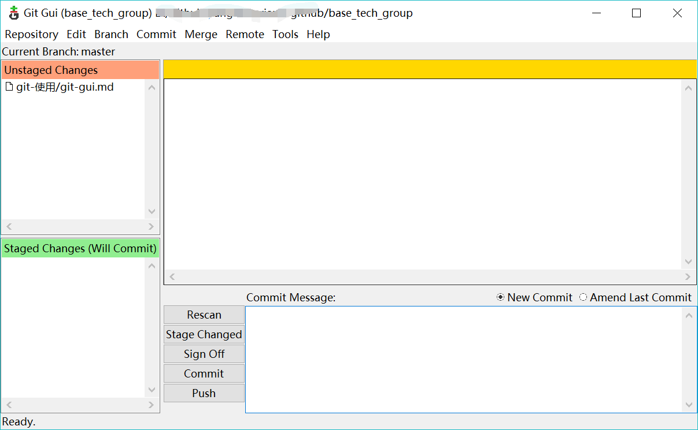

# git gui 使用介绍
---
## 基本使用
`windows下的使用方式`
1. 本地仓库文件夹下，`shift+鼠标右键`，选择`Git Gui Here`，打开git gui操作页面
2. git add添加文件，`ctrl + i`
3. git commit提交，界面点击commit
4. 推送到远程仓库，界面点击push
PS：第一次使用应该会提示输入github用户名和密码，后面貌似就不会再要求输入了