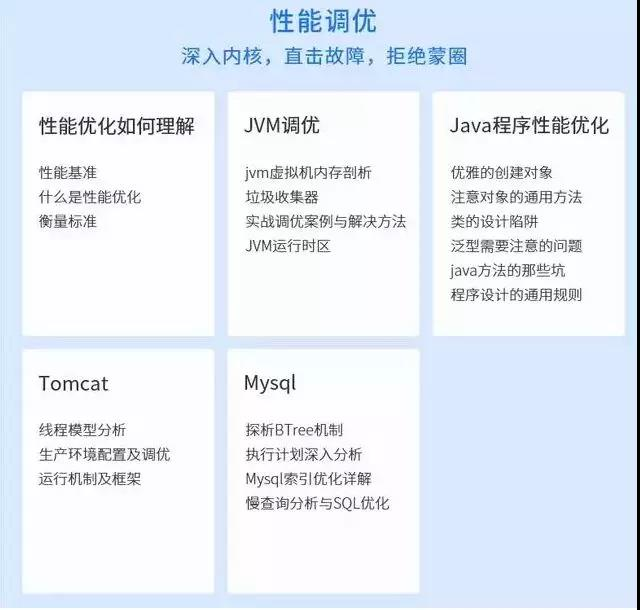
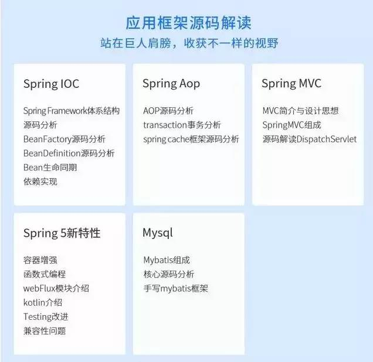
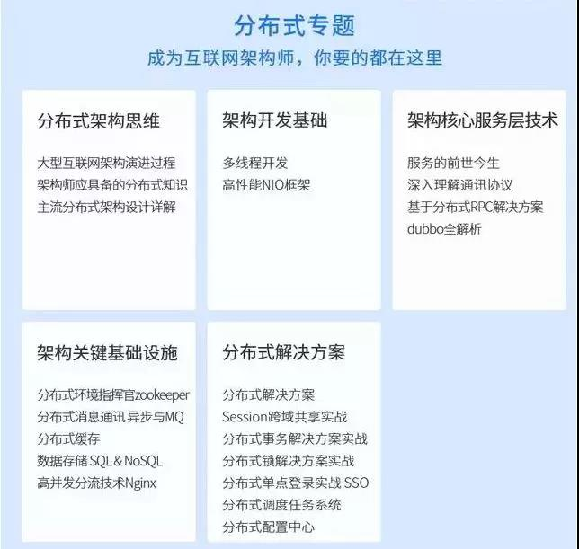
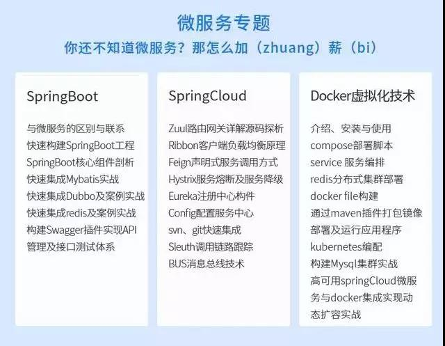
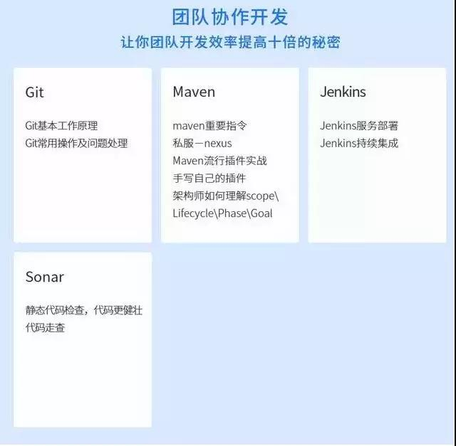
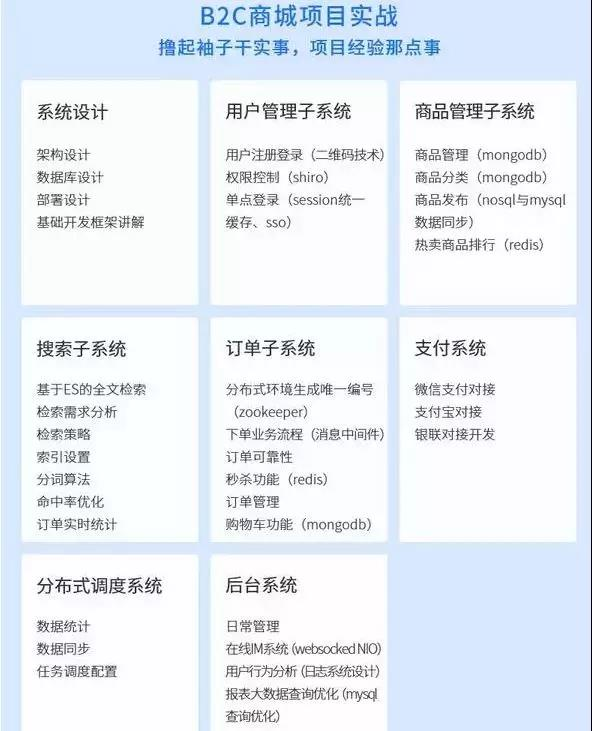

+ 写出java中synchronized的使用方式。
+ Java中设置最大堆和最小堆内存的参数是什么？
+ volatile的作用？
+ 一道设计题
多个线程同时读写，读线程的数量远远⼤于写线程，你认为应该如何解决 并发的问题？你会选择加什么样的锁？
+ JAVA的AQS是否了解，它是⼲嘛的？
+ 除了synchronized关键字之外，你是怎么来保障线程安全的？
+ 什么时候需要加volatile关键字？它能保证线程安全吗？

---

1. “请你自我介绍一下”
2. “你有什么业余爱好？”
3. “你认为你工作中的哪些方面是最重要的？”
4. “谈谈你的缺点”
5. “谈一谈你的一次失败经历”
6. “你为什么选择我们公司？”
7. “对这项工作，你有哪些可预见的困难？”
8. “我们为什么要录用你？”
9. “您在前一家公司的离职原因是什么？”

---

1. 你知道哪些或者你们线上使用什么GC策略? 它有什么优势，适用于什么 场景？
2. JAVA类加载器包括几种？它们之间的关系是怎么样的？双亲委派机 制是什么意思？有什么好处？
3. 如何定义个类加载器？你使用过哪些或者你在什么场景下需要定义的类加载器？
4. Perm Space中保存什么数据? 会引起OutOfMemory吗？ 5.做gc时，对象在内存各个Space中被移动的顺序是什么？
6. 你有没有遇到过OutOfMemory问题？你是怎么来处理这个问题的？处理 过程中有哪些收获？
7. 1.8之后Perm Space有哪些变动? MetaSpace默认是⽆限的么? 还是 你们会通过什么⽅式来指定?
8. Jstack是⼲什么的? Jstat呢? 如果线上程序周期性地出现卡顿，你怀疑可 能是gc导致的，你会怎么来排查这个问题？线程日志一般你会看其中的什么 部分？
9. StackOverFlow异常有没有遇到过？一般你猜测会在什么情况下被触 发？
10. 如何指定一个线程的堆栈？一般你们写多少？

---
1. 简述synchronized?Object；Monitor机制；
2. 简述happen-before规则 ；
3. JUC和Object ； Monitor机制区别是什么 ； 简述AQS原理 ；
4. 简述DCL失效原因，解决方法 ；
5. 简述nio原理 ；
6. jvm运行时数据区域有哪几部分组成，各自作用 ；
7. gc算法有哪些 ； gc收集器有哪些 ；
8. 简述class加载各阶段过程 ； class ； loader有哪些模型 ；
9. 简述常用的JDK命令行工具 ；
10. 简述字节码文件组成 ；
11. 讲讲你平常是如何针对具体的SQL做优化 ；
12. mysql的存储引擎有哪些，区别 ；
13. gc:内存模型；
14. gc: 垃圾回收 ；
15. 多线程：如何实现一个定时调度和循环调度的工具类。但提交任务处理不过来的时候，拒绝机制应该如何处理 ； 线程池默认有哪几种拒绝机制 ；
16. 多线程： 如何实现一个ThreadLocal ；
17. 说说你了解的一个线程安全队列 ；
18. Atomic包的实现原理是什么 ；
19. CAS又是怎么保证原子性的 ；
20. string分析1000次循环subString用了多少内存 ；

---
1. 性能调优  

2. 源码解读  

3. 分布式

4. 微服务

5. 团队协作开发

6. B2C商城实战

